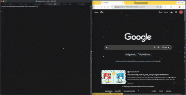

<p align="center">
  
</p>

<h1 align="center">AgentWard</h1>

<p align="center">
  <strong>Open-source permission control plane for AI agents.</strong><br/>
  Scan, enforce, and audit every tool call.
</p>

<p align="center">
  <a href="https://pypi.org/project/agentward/"></a>
  <a href="https://github.com/agentward-ai/agentward/blob/main/LICENSE"></a>
  <a href="https://www.python.org/downloads/"></a>
</p>

---

<p align="center">
  
</p>

Telling an agent *"don't touch the stove"* is a natural-language guardrail that can be circumvented. AgentWard puts a **physical lock on the stove** — code-level enforcement that prompt injection can't override.

AgentWard sits between AI agents and their tools (MCP servers, HTTP gateways, function calls) to enforce least-privilege policies, inspect data flows at runtime, and generate compliance audit trails. Policies are enforced **in code, outside the LLM context window** — the model never sees them, can't override them, can't be tricked into ignoring them.

## Why AgentWard?

AI agents now have access to your email, calendar, filesystem, shell, databases, and APIs. The tools exist to *give* agents these capabilities. But **nothing exists to control what they do with them.**

| What exists today | What it does | What it doesn't do |
|---|---|---|
| **Static scanners** (mcp-scan, Cisco Skill Scanner) | Scan tool definitions, report risks | No runtime enforcement. Scan and walk away. |
| **Guardrails frameworks** (NeMo, Guardrails AI) | Filter LLM inputs/outputs | Don't touch tool calls. An agent can still `rm -rf /`. |
| **Prompt-based rules** (SecureClaw) | Inject safety instructions into agent context | Vulnerable to prompt injection. The LLM can be tricked into ignoring them. |
| **IAM / OAuth** | Control who can access what | Control *humans*, not *agents*. An agent with your OAuth token has your full permissions. |

The gap: **No tool-level permission enforcement that actually runs in code, outside the LLM, at the point of every tool call.** Scanners find problems but don't fix them. Guardrails protect the model but not the tools. Prompt rules are suggestions, not enforcement.

AgentWard fills this gap. It's a proxy that sits between agents and tools, evaluating every `tools/call` against a declarative policy — in code, at runtime, where prompt injection can't reach.

## Quick Start

```bash
pip install agentward
```

### 1. Scan your tools

```bash
agentward scan
```

Auto-discovers MCP configs (Claude Desktop, Cursor, Windsurf, VS Code), Python tool definitions (OpenAI, LangChain, CrewAI), and ClawdBot/OpenClaw skills. Outputs a permission map with risk ratings and security recommendations.

```
 Server          Tool                 Risk    Data Access
 ─────────────── ──────────────────── ─────── ──────────────────
 filesystem      read_file            MEDIUM  File read
 filesystem      write_file           HIGH    File write
 github          create_issue         MEDIUM  GitHub API
 shell-executor  run_command          CRITICAL Shell execution
```

### 2. Generate a policy

```bash
agentward configure
```

Generates a smart-default `agentward.yaml` with security-aware rules based on what `scan` found — skill restrictions, approval gates, and chaining rules tailored to your setup.

```yaml
# agentward.yaml (generated)
version: "1.0"
skills:
  filesystem:
    read_file: { action: allow }
    write_file: { action: approve }   # requires human approval
  shell-executor:
    run_command: { action: block }    # blocked entirely
require_approval:
  - send_email
  - delete_file
```

### 3. Wire it in

```bash
# MCP servers (Claude Desktop, Cursor, etc.)
agentward setup --policy agentward.yaml

# Or for ClawdBot gateway
agentward setup --gateway clawdbot
```

Rewrites your MCP configs so every tool call routes through the AgentWard proxy. For ClawdBot, swaps the gateway port so AgentWard sits as an HTTP reverse proxy.

### 4. Enforce at runtime

```bash
# MCP stdio proxy
agentward inspect --policy agentward.yaml -- npx @modelcontextprotocol/server-filesystem /tmp

# HTTP gateway proxy
agentward inspect --gateway clawdbot --policy agentward.yaml
```

Every tool call is now intercepted, evaluated against your policy, and either allowed, blocked, or flagged for approval. Full audit trail logged.

```
 [ALLOW]  filesystem.read_file        /tmp/notes.txt
 [BLOCK]  shell-executor.run_command   rm -rf /
 [APPROVE] gmail.send_email            → waiting for human approval
```

## How It Works

AgentWard operates as a transparent proxy between agents and their tools:

```
Agent Host                    AgentWard                     Tool Server
(Claude, Cursor, etc.)        (Proxy + Policy Engine)       (MCP, Gateway)

    tools/call ──────────►  Intercept ──► Policy check
                              │                │
                              │    ALLOW ──────┼──────► Forward to server
                              │    BLOCK ──────┼──────► Return error
                              │    APPROVE ────┼──────► Wait for human
                              │                │
                              └── Audit log ◄──┘
```

**Two proxy modes, same policy engine:**

| Mode | Transport | Intercepts | Use Case |
|------|-----------|------------|----------|
| **Stdio** | JSON-RPC 2.0 over stdio | `tools/call` | MCP servers (Claude Desktop, Cursor, Windsurf, VS Code) |
| **HTTP** | HTTP reverse proxy + WebSocket | `POST /tools-invoke` | ClawdBot gateway, HTTP-based tools |

## CLI Commands

| Command | Description |
|---------|-------------|
| `agentward scan` | Static analysis — discover tools, generate permission maps, risk ratings |
| `agentward configure` | Generate smart-default policy YAML from scan results |
| `agentward setup` | Wire proxy into MCP configs or gateway ports |
| `agentward inspect` | Start runtime proxy with live policy enforcement |
| `agentward comply` | Compliance evaluation against regulatory frameworks *(coming soon)* |

## Policy Actions

| Action | Behavior |
|--------|----------|
| `allow` | Tool call forwarded transparently |
| `block` | Tool call rejected, error returned to agent |
| `approve` | Tool call held for human approval before forwarding |
| `log` | Tool call forwarded, but logged with extra detail |
| `redact` | Tool call forwarded with sensitive data stripped |

## What AgentWard Is NOT

- **Not a static scanner** — Scanners like mcp-scan analyze and walk away. AgentWard scans *and* enforces at runtime.
- **Not a guardrails framework** — NeMo Guardrails and Guardrails AI focus on LLM input/output. AgentWard controls the *tool calls*.
- **Not prompt-based enforcement** — Injecting safety rules into the LLM context is vulnerable to prompt injection. AgentWard enforces policies in code, outside the context window.
- **Not an IAM system** — AgentWard complements IAM. It controls what *agents* can do with the permissions they already have.

## Supported Platforms

**MCP Hosts (stdio proxy):**
- Claude Desktop
- Claude Code
- Cursor
- Windsurf
- VS Code Copilot
- Any MCP-compatible client

**HTTP Gateways:**
- ClawdBot (with WebSocket passthrough for UI)
- Extensible to other HTTP-based tool gateways

**Python Tool Scanning:**
- OpenAI SDK (`@tool` decorators)
- LangChain (`@tool`, `StructuredTool`)
- CrewAI (`@tool`)
- Anthropic SDK

## Development

```bash
# Clone and set up
git clone https://github.com/agentward-ai/agentward.git
cd agentward
python3 -m venv .venv && source .venv/bin/activate
pip install -e ".[dev]"

# Run tests
pytest

# Lint
ruff check agentward/
```

## Roadmap

- [x] MCP stdio proxy with policy enforcement
- [x] HTTP reverse proxy with WebSocket passthrough
- [x] Static scanner (MCP configs, Python tools, OpenClaw skills)
- [x] Smart-default policy generation
- [x] MCP config wrapping (`agentward setup`)
- [x] Audit logging (JSON Lines + rich stderr)
- [ ] Skill chaining analysis and enforcement
- [ ] Human-in-the-loop approval flow
- [ ] Compliance frameworks (HIPAA, SOX, GDPR, PCI-DSS)
- [ ] Data classifier (PII/PHI detection)
- [ ] Data boundary enforcement
- [ ] Skill Compliance Registry

## License

[Apache 2.0](LICENSE)

---

<p align="center">
  <a href="https://agentward.ai">agentward.ai</a> · <a href="https://github.com/agentward-ai/agentward">GitHub</a>
</p>
