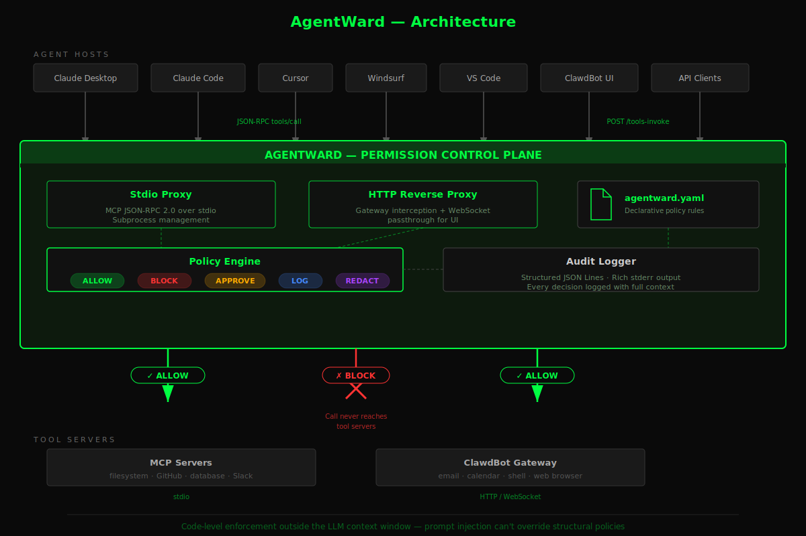

<p align="center">
  
</p>

<h1 align="center">AgentWard</h1>

<p align="center">
  <strong>Open-source permission control plane for AI agents.</strong><br/>
  Scan, enforce, and audit every tool call.
</p>

<p align="center">
  <a href="https://pypi.org/project/agentward/"></a>
  <a href="https://github.com/agentward-ai/agentward/blob/main/LICENSE"></a>
  <a href="https://www.python.org/downloads/"></a>
</p>

---

<p align="center">
  <video src="https://github.com/user-attachments/assets/f96dbb8c-8e07-4efb-a931-60c1fb64bde7" width="900" controls></video>
</p>

Telling an agent *"don't touch the stove"* is a natural-language guardrail that can be circumvented. AgentWard puts a **physical lock on the stove** — code-level enforcement that prompt injection can't override.

AgentWard sits between AI agents and their tools (MCP servers, HTTP gateways, function calls) to enforce least-privilege policies, inspect data flows at runtime, and generate compliance audit trails. Policies are enforced **in code, outside the LLM context window** — the model never sees them, can't override them, can't be tricked into ignoring them.

## Why AgentWard?

AI agents now have access to your email, calendar, filesystem, shell, databases, and APIs. The tools exist to *give* agents these capabilities. But **nothing exists to control what they do with them.**

| What exists today | What it does | What it doesn't do |
|---|---|---|
| **Static scanners** (mcp-scan, Cisco Skill Scanner) | Scan tool definitions, report risks | No runtime enforcement. Scan and walk away. |
| **Guardrails frameworks** (NeMo, Guardrails AI) | Filter LLM inputs/outputs | Don't touch tool calls. An agent can still `rm -rf /`. |
| **Prompt-based rules** (SecureClaw) | Inject safety instructions into agent context | Vulnerable to prompt injection. The LLM can be tricked into ignoring them. |
| **IAM / OAuth** | Control who can access what | Control *humans*, not *agents*. An agent with your OAuth token has your full permissions. |

The gap: **No tool-level permission enforcement that actually runs in code, outside the LLM, at the point of every tool call.** Scanners find problems but don't fix them. Guardrails protect the model but not the tools. Prompt rules are suggestions, not enforcement.

AgentWard fills this gap. It's a proxy that sits between agents and tools, evaluating every `tools/call` against a declarative policy — in code, at runtime, where prompt injection can't reach.

## Prerequisites

AgentWard scans and enforces policies on your existing AI agent tools. You need **at least one** of:

- **[Cursor](https://cursor.com)** with MCP servers configured
- **[Claude Desktop](https://claude.ai/download)** with MCP servers configured
- **[VS Code](https://code.visualstudio.com/)** with MCP servers (Copilot or extensions)
- **[Windsurf](https://codeium.com/windsurf)** with MCP servers configured
- **[OpenClaw](https://github.com/openclaw)** with skills installed

No MCP servers yet? AgentWard can also scan Python tool definitions (OpenAI, LangChain, CrewAI) in any project directory.

## Quick Start

```bash
pip install agentward
agentward init
```

That's it. `agentward init` scans your tools, shows a risk summary, generates a recommended policy, and wires AgentWard into your environment. Most users don't need anything else.

If you want more control, you can run each step individually:


#### 1. Scan your tools

```bash
agentward scan
```

Auto-discovers MCP configs (Claude Desktop, Cursor, Windsurf, VS Code), Python tool definitions (OpenAI, LangChain, CrewAI), and OpenClaw skills. Outputs a permission map with risk ratings, skill chain analysis, security recommendations, and developer fix guidance. A markdown report (`agentward-report.md`) is saved automatically.

```bash
agentward scan ~/clawd/skills/bankr/          # scan a single skill
agentward scan ~/.cursor/mcp.json             # scan specific MCP config
agentward scan ~/project/                     # scan directory
agentward scan --format html                  # shareable HTML report with security score
agentward scan --format sarif                 # SARIF output for GitHub Security tab
```

#### 2. Generate a policy

```bash
agentward configure
```

Generates a smart-default `agentward.yaml` with security-aware rules based on what `scan` found — skill restrictions, approval gates, and chaining rules tailored to your setup.

```yaml
# agentward.yaml (generated)
version: "1.0"
default_action: allow               # or "block" for zero-trust (allowlist mode)
skills:
  filesystem:
    read_file: { action: allow }
    write_file: { action: approve }   # requires human approval
  shell-executor:
    run_command: { action: block }    # blocked entirely
require_approval:
  - send_email                        # always requires approval
  - delete_file
  - tool: shell_exec                  # conditional: only sudo commands
    when:
      command:
        contains: sudo
```

#### 3. Wire it in

```bash
# MCP servers (Claude Desktop, Cursor, etc.)
agentward setup --policy agentward.yaml

# Or for OpenClaw gateway
agentward setup --gateway openclaw
```

Rewrites your MCP configs so every tool call routes through the AgentWard proxy. For OpenClaw, swaps the gateway port so AgentWard sits as an HTTP reverse proxy.

#### 4. Enforce at runtime

```bash
# MCP stdio proxy
agentward inspect --policy agentward.yaml -- npx @modelcontextprotocol/server-filesystem /tmp

# HTTP gateway proxy (start proxy first, then restart OpenClaw)
agentward inspect --gateway openclaw --policy agentward.yaml
# In another terminal:
openclaw gateway restart

# Dry-run mode — observe what would be blocked without enforcing
agentward inspect --gateway openclaw --policy agentward.yaml --dry-run
```

> **Start order matters for OpenClaw:** The AgentWard proxy must be running *before* OpenClaw restarts, because OpenClaw connects to external services (like Telegram) immediately on startup. If the proxy isn't up yet, those connections fail silently.

Every tool call is now intercepted, evaluated against your policy, and either allowed, blocked, or flagged for approval. Full audit trail logged.

```
 [ALLOW]  filesystem.read_file        /tmp/notes.txt
 [BLOCK]  shell-executor.run_command   rm -rf /
 [APPROVE] gmail.send_email            → waiting for human approval
```

#### 5. Visualize your permission graph

```bash
agentward map                                   # terminal visualization
agentward map --policy agentward.yaml           # with policy overlay
agentward map --format mermaid -o graph.md      # export as Mermaid diagram
```

Shows servers, tools, data access types, risk levels, and detected skill chains. With `--policy`, overlays ALLOW/BLOCK/APPROVE decisions on the graph.

#### 6. Review audit trail

```bash
agentward audit                                # read default log (agentward-audit.jsonl)
agentward audit --log /path/to/audit.jsonl     # specify log path
agentward audit --decision BLOCK               # filter by decision type
agentward audit --tool gmail --last 100        # filter by tool name, last 100 entries
agentward audit --timeline                     # show event timeline
agentward audit --json                         # machine-readable output
```

Shows summary stats, decision breakdowns (ALLOW/BLOCK/APPROVE counts), top tools, chain violations, and optionally a chronological timeline.

#### 7. Compare policy changes

```bash
agentward diff old.yaml new.yaml               # rich diff output
agentward diff old.yaml new.yaml --json        # JSON for CI
```

Shows exactly what changed between two policy files — permissions added/removed, approval rules, chaining rules. Each change is classified as **breaking** (tightening enforcement) or **relaxing** (loosening enforcement). Useful for PR reviews.

## How It Works

AgentWard operates as a transparent proxy between agents and their tools:

```
Agent Host                    AgentWard                     Tool Server
(Claude, Cursor, etc.)        (Proxy + Policy Engine)       (MCP, Gateway)

    tools/call ──────────►  Intercept ──► Policy check
                              │                │
                              │    ALLOW ──────┼──────► Forward to server
                              │    BLOCK ──────┼──────► Return error
                              │    APPROVE ────┼──────► Wait for human
                              │                │
                              └── Audit log ◄──┘
```

**Two proxy modes, same policy engine:**

| Mode | Transport | Intercepts | Use Case |
|------|-----------|------------|----------|
| **Stdio** | JSON-RPC 2.0 over stdio | `tools/call` | MCP servers (Claude Desktop, Cursor, Windsurf, VS Code) |
| **HTTP** | HTTP reverse proxy + WebSocket | `POST /tools-invoke` | OpenClaw gateway, HTTP-based tools |

## CLI Commands

| Command | Description |
|---------|-------------|
| `agentward init` | One-command setup — scan, generate policy, wire environment, start proxy |
| `agentward scan` | Static analysis — permission maps, risk ratings, skill chains, fix guidance |
| `agentward configure` | Generate smart-default policy YAML from scan results |
| `agentward setup` | Wire proxy into MCP configs or gateway ports |
| `agentward inspect` | Start runtime proxy with live policy enforcement |
| `agentward audit` | Read audit logs — summary stats, decision breakdowns, event timelines |
| `agentward map` | Visualize the permission and chaining graph (terminal or Mermaid) |
| `agentward diff` | Compare two policy files — shows breaking vs. relaxing changes |
| `agentward status` | Show live proxy status and current session statistics |
| `agentward comply` | Evaluate policies against regulatory frameworks (HIPAA, SOX, GDPR, PCI-DSS) with auto-fix |

## Policy Actions

| Action | Behavior |
|--------|----------|
| `allow` | Tool call forwarded transparently |
| `block` | Tool call rejected, error returned to agent |
| `approve` | Tool call held for human approval before forwarding |
| `log` | Tool call forwarded, but logged with extra detail |
| `redact` | Tool call forwarded with sensitive data stripped |

## Remote Approval via Telegram

If you use OpenClaw with Telegram, AgentWard can send approval requests to your Telegram chat — so you can approve or deny tool calls from your phone when you're away from your machine.

```bash
# After starting the proxy, send /start to your OpenClaw bot on Telegram
# to pair your chat. You'll see "Telegram paired" in the proxy output.
```

Once paired, any tool call with `action: approve` in your policy will show an inline keyboard in Telegram with **Allow Once**, **Allow Session**, and **Deny** buttons. Both the local macOS dialog and Telegram race in parallel — whichever you respond to first wins.

## PII Sanitization

AgentWard includes a built-in PII detection and redaction engine — available both as a **Python module** in the pip package and as a **standalone zero-dependency skill** for AI agents.

### Python module (`pip install agentward`)

```python
from agentward.sanitize.detectors.regex_detector import detect_all
from agentward.sanitize.models import PIICategory

entities = detect_all("SSN: 123-45-6789, email: user@example.com")
for e in entities:
    print(f"{e.category.value}: {e.text}")
```

Optional NER support (spaCy) for person names, organizations, and locations:

```bash
pip install agentward[sanitize]   # adds spacy + pypdf
```

### Standalone skill (OpenClaw / Claude Code)

A zero-dependency Python script that agents can call directly — no pip install needed:

```bash
# Sanitize a file (always use --output to avoid exposing raw PII)
python scripts/sanitize.py patient-notes.txt --output clean.txt

# Preview mode (detect PII categories without showing raw values)
python scripts/sanitize.py notes.md --preview

# Filter to specific categories
python scripts/sanitize.py log.txt --categories ssn,credit_card,email --output clean.txt
```

Published on [ClawHub](https://clawhub.ai) as the `sanitize` skill. Install via OpenClaw or add to `.claude/commands/` for Claude Code.

### Supported PII categories (15)

| Category | Example |
|---|---|
| Credit card (Luhn-validated) | `4111 1111 1111 1111` |
| SSN | `123-45-6789` |
| CVV (keyword-anchored) | `CVV: 123` |
| Expiry date (keyword-anchored) | `exp: 01/30` |
| API key (provider prefix) | `sk-abc...`, `ghp_...`, `AKIA...` |
| Email | `user@example.com` |
| Phone (US/intl) | `+1 (555) 123-4567` |
| IP address (IPv4) | `192.168.1.100` |
| Date of birth (keyword-anchored) | `DOB: 03/15/1985` |
| Passport (keyword-anchored) | `Passport: AB1234567` |
| Driver's license (keyword-anchored) | `DL: D12345678` |
| Bank routing (keyword-anchored) | `routing: 021000021` |
| US mailing address | `742 Evergreen Terrace Dr, Springfield, IL 62704` |
| Medical license (keyword-anchored) | `License: CA-MD-8827341` |
| Insurance/member ID (keyword-anchored) | `Member ID: BCB-2847193` |

All processing is local — zero network calls, zero dependencies (stdlib only for the standalone skill).

## What AgentWard Is NOT

- **Not a static scanner** — Scanners like mcp-scan analyze and walk away. AgentWard scans *and* enforces at runtime.
- **Not a guardrails framework** — NeMo Guardrails and Guardrails AI focus on LLM input/output. AgentWard controls the *tool calls*.
- **Not prompt-based enforcement** — Injecting safety rules into the LLM context is vulnerable to prompt injection. AgentWard enforces policies in code, outside the context window.
- **Not an IAM system** — AgentWard complements IAM. It controls what *agents* can do with the permissions they already have.

## Supported Platforms

**MCP Hosts (stdio proxy):**
- Claude Desktop
- Claude Code
- Cursor
- Windsurf
- VS Code Copilot
- Any MCP-compatible client

**HTTP Gateways:**
- OpenClaw (latest) and ClawdBot (legacy) — both supported
- Extensible to other HTTP-based tool gateways

**Python Tool Scanning:**
- OpenAI SDK (`@tool` decorators)
- LangChain (`@tool`, `StructuredTool`)
- CrewAI (`@tool`)
- Anthropic SDK

## Development

```bash
# Clone and set up
git clone https://github.com/agentward-ai/agentward.git
cd agentward
python3 -m venv .venv && source .venv/bin/activate
pip install -e ".[dev]"

# Run tests
pytest

# Lint
ruff check agentward/
```

## Current Status & What's Tested

AgentWard is early-stage software. We're being upfront about what works well and what hasn't been battle-tested yet.

**Tested end-to-end and working well:**
- `agentward init` — one-command scan, policy generation, and environment wiring (macOS)
- `agentward scan` — static analysis across MCP configs, Python tools, and OpenClaw skills (macOS)
- `agentward configure` — policy YAML generation from scan results
- `agentward setup --gateway openclaw` — OpenClaw gateway port swapping + LaunchAgent plist patching
- `agentward inspect --gateway openclaw` — runtime enforcement of OpenClaw skill calls via LLM API interception (Anthropic provider, streaming mode). This is our most thoroughly tested path.
- `agentward comply` — regulatory compliance evaluation across HIPAA (§164.312/§164.308), SOX (§404), GDPR (Art. 5–32), and PCI-DSS v4.0 (Req. 1–10), each with 8 controls, auto-fix policy generation (1500+ tests)
- PII sanitization — 15 categories, regex-based detection with Luhn validation, keyword anchoring, false positive mitigation

**Built and unit-tested but not yet end-to-end verified:**
- MCP stdio proxy (`agentward inspect -- npx server`) — the proxy, protocol parsing, and policy engine are tested in isolation with 1200+ unit tests, but we haven't run a full session with Claude Desktop/Cursor through the proxy yet
- OpenAI provider interception (Chat Completions + Responses API) — interceptors are unit-tested but no live OpenAI traffic has flowed through them
- Skill chaining enforcement — the chain tracker and policy evaluation work in tests, but the real-world interaction patterns haven't been validated
- `agentward setup` for MCP config wrapping (Claude Desktop, Cursor, Windsurf, VS Code) — config rewriting is tested, but we haven't verified the full setup → restart → use cycle for each host

**Platform support:**
- **macOS** — developed and tested here. This is the only platform we're confident about.
- **Linux** — should work for MCP stdio proxy and static scanning. HTTP gateway mode is macOS-specific (LaunchAgent plist patching).
- **Windows** — untested. Signal handling, path resolution, and process management may have issues.

If you run into problems on any path we haven't tested, please [open an issue](https://github.com/agentward-ai/agentward/issues) — it helps us prioritize.

## Troubleshooting

### "Tool is blocked" after re-enabling it in the policy

After you block a tool (e.g., `browser: denied: true`), the LLM receives a message like `[AgentWard: blocked tool 'browser']` in the conversation. If you then re-enable the tool by editing `agentward.yaml` and restarting the proxy, the LLM may still *choose not to use it* — because the block message is in its conversation history and it "remembers" the restriction.

**This is not AgentWard blocking the tool.** It's the LLM avoiding a tool it previously saw fail. The fix: **start a new chat session** after changing your policy. A fresh conversation has no memory of the previous block.

You can confirm by checking the proxy output — if you see `ALLOW` for the tool (or no `BLOCK` message), AgentWard is letting it through.

### Port already in use (OSError Errno 48)

If `agentward inspect` fails with "address already in use", either a previous proxy didn't exit cleanly or the gateway hasn't picked up its new port.

```bash
# Check what's using the ports
lsof -i :18789 -i :18790

# Kill stale proxy if needed, then restart
agentward inspect --gateway openclaw --policy agentward.yaml
```

### OpenClaw gateway won't restart on new port

`agentward setup --gateway openclaw` patches both the config JSON and the macOS LaunchAgent plist. If the gateway still binds to the old port after restart, verify both files were updated:

```bash
# Check config port (new OpenClaw path or legacy ClawdBot path)
cat ~/.openclaw/openclaw.json | grep port     # new installs
cat ~/.clawdbot/clawdbot.json | grep port     # legacy installs

# Check plist port (name depends on version)
plutil -p ~/Library/LaunchAgents/ai.openclaw.gateway.plist | grep -A1 port     # new
plutil -p ~/Library/LaunchAgents/com.clawdbot.gateway.plist | grep -A1 port    # legacy
```

Then restart with: `openclaw gateway restart`

### Compatibility: OpenClaw vs ClawdBot

AgentWard auto-detects both the latest OpenClaw (`~/.openclaw/openclaw.json`, `ai.openclaw.gateway.plist`) and legacy ClawdBot (`~/.clawdbot/clawdbot.json`, `com.clawdbot.gateway.plist`). No configuration needed — it finds whichever you have installed.

## License

[Apache 2.0](LICENSE)

---

<p align="center">
  <a href="https://agentward.ai">agentward.ai</a> · <a href="https://github.com/agentward-ai/agentward">GitHub</a>
</p>
